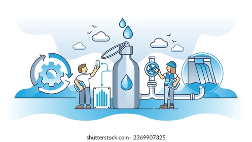

# Water Quality Data Analysis using Python

A key focus of machine learning research lies in analyzing water quality, often termed as water potability assessment. The aim is to understand the myriad factors impacting water safety and to construct machine learning models proficient in discerning whether a given water sample meets consumption standards. This endeavor involves thorough exploration of variables affecting potability and the creation of predictive models to classify water samples based on their safety for consumption.
